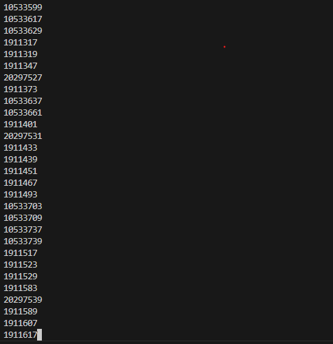
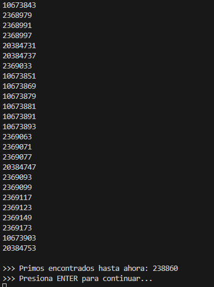

# Snake Race — ARSW Lab #1 (Java 21, Virtual Threads)

## Author: Daniel Esteban Rodriguez Suarez

# Laboratory Development

## Part I — (Warm-up) `wait/notify` in a multi-threaded program

### Description

Part I consists of a multithreaded Java program that searches for prime 
numbers in the range from 0 to 30,000,000. The workload is divided among 
3 worker threads, each responsible for a different segment of the range.

The program runs the search concurrently and every 5 seconds automatically 
pauses all threads, prints how many prime numbers have been found so far, 
and waits for the user to press ENTER before resuming. This cycle repeats 
until all numbers in the range have been evaluated.

The goal of this part is to practice thread suspension and resumption 
without busy-waiting, using Java's monitor model (`synchronized`, `wait()`, 
and `notifyAll()`).

### What was modified
The `PrimeFinderThread` and `Control` classes were modified to support 
pause/resume behavior every `t` milliseconds without busy-waiting.

### Synchronization design

**Lock used:**  
A shared `Object monitor` is created in `Control` and passed to every 
`PrimeFinderThread` via constructor. All threads synchronize on this 
same object, making it the single monitor for the entire system.

**Condition used:**  
A `volatile boolean paused` flag inside each `PrimeFinderThread` acts 
as the condition. Worker threads check this flag at the end of each 
number evaluation inside a `synchronized(monitor)` block.

**How busy-waiting is avoided:**  
Instead of looping on the flag without releasing the CPU, each thread 
calls `monitor.wait()` when `paused == true`. This releases the lock 
and suspends the thread until `Control` calls `monitor.notifyAll()`, 
which wakes all waiting threads at once.

**How lost wakeups are avoided:**  
The condition check uses a `while` loop instead of `if`:

```java
synchronized (monitor) {
    while (paused) {
        monitor.wait();
    }
}
```

This ensures that even if a spurious wakeup occurs, the thread 
re-checks the condition before continuing execution.

**Resume flow:**  
After the user presses ENTER, `Control` sets `paused = false` on all 
threads and calls `monitor.notifyAll()` inside a `synchronized(monitor)` 
block, guaranteeing all sleeping threads are woken up consistently.

## Evidence

- First screenshot shows the program paused after 5 seconds, displaying the count of primes found so far.


- Second screenshot shows the program resumed after pressing ENTER, with worker threads continuing their search.



- Third screenshot shows the program paused again after another 5 seconds, with an updated count of primes found.



### Observations

1. **notifyAll() over notify():** `notifyAll()` is used to wake all worker 
   threads at once. Using `notify()` would risk leaving threads sleeping 
   indefinitely.

2. **volatile flag:** The `paused` flag is `volatile` to ensure changes 
   made by `Control` are immediately visible to all threads.

3. **No deadlock risk:** Since `Control` always calls `notifyAll()` after 
   setting `paused = false`, no thread can wait forever.


## Part II — Concurrent SnakeRace (core of the lab)


